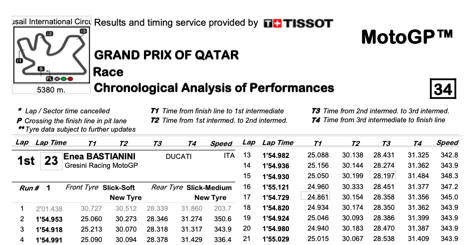

## Методика оценки результатов MotoGP

### Краткое описание проекта
 
В данном проекте реализована методика для объективной оценки выступлений гонщиков чемпионата MotoGP.  
По результатам гонки формируется итоговый рейтинг с оценками гонщиков, финишровавших в топ-12.  
 
Методика полностью автоматизирована:

- данные автоматически скачиваются с сайта в формате .pdf
- извлекаются из .pdf в виде списка, состоящего их большого числа строк 
- переформатируются в датафреймы pandas
- далее считаются итоговые метрики и строятся графики

В рамках данного проекта реализованы все этапы типовой аналитической задачи (data engineering, data analysis):

- Постановка задачи
- Выбор метода оценки и определение метрик
- Определение источника данных
- Автоматизированное извлечение данных из источника
- Преобразование данных
- Расчет метрик 
- Визуализация результатов
 
**Исходные данные** (протокол результатов гран-при в формате .pdf):

**Визуализация результатов** 

В заголовке для каждого гонщика укаывается его место в итоговом рейтинге (R12).
Далее приводятся точечные оценки по каждому из трёх показателей и место в рейтинге:

- Start - число отыгранных/потерянных мест на старте
- Overtakes - число отыгранных/потерянных мест по ходу гонки относительно общего числа изменения позиций данного гонщика
- Density - плотность времени прохождения каждого круга

На левом графике показаны позиции гонщика: стартовая, финишная, динамика по ходу гонки.  
На правом графике показаны врмена прохождения каждого круга, время лучшего круга, а также линия "идеальных" времен для этого гонщика.

