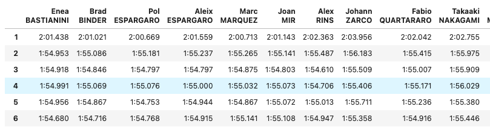

## Методика оценки результатов MotoGP

### Краткое описание проекта
 
В данном проекте реализована методика оценки выступлений гонщиков чемпионата MotoGP. После обработки протокола гонки формируется датафрейм с оценками по трем метрикам, а также общим рейтингом.  
 
Методика полностью автоматизирована:

- протокол с результатами гонки автоматически скачивается с сайта MotoGP в формате .pdf (скачивание происходит не по прямым ссылкам, а с помощью навигации и выбора нужного раздела сайта через меню);
- данные извлекаются из .pdf в виде списка, состоящего их большого числа строк и переформатируются в датафреймы pandas;
- далее считаются итоговые метрики и строятся графики.

 
**Исходные данные** (протокол результатов гран-при в формате .pdf скачивается с сайта www.motogp.com)

**Выгруженные сырые данные**

**Преобразованные данные**

**Результаты** 

**Образцы графиков**

В заголовке для каждого гонщика укаывается его финишная позиция (P) и место в итоговом рейтинге (R).  
Далее приводятся точечные оценки по каждому из трёх показателей и место в рейтинге:

- Start - число отыгранных/потерянных мест на старте;
- Overtakes - число отыгранных/потерянных мест по ходу гонки относительно общего числа изменения позиций данного гонщика;
- Density - плотность времени прохождения каждого круга.

На левом графике показаны позиции гонщика: стартовая, финишная, динамика по ходу гонки.  
На правом графике показаны врмена прохождения каждого круга, время лучшего круга, а также линия "идеальных" времен для этого гонщика.
